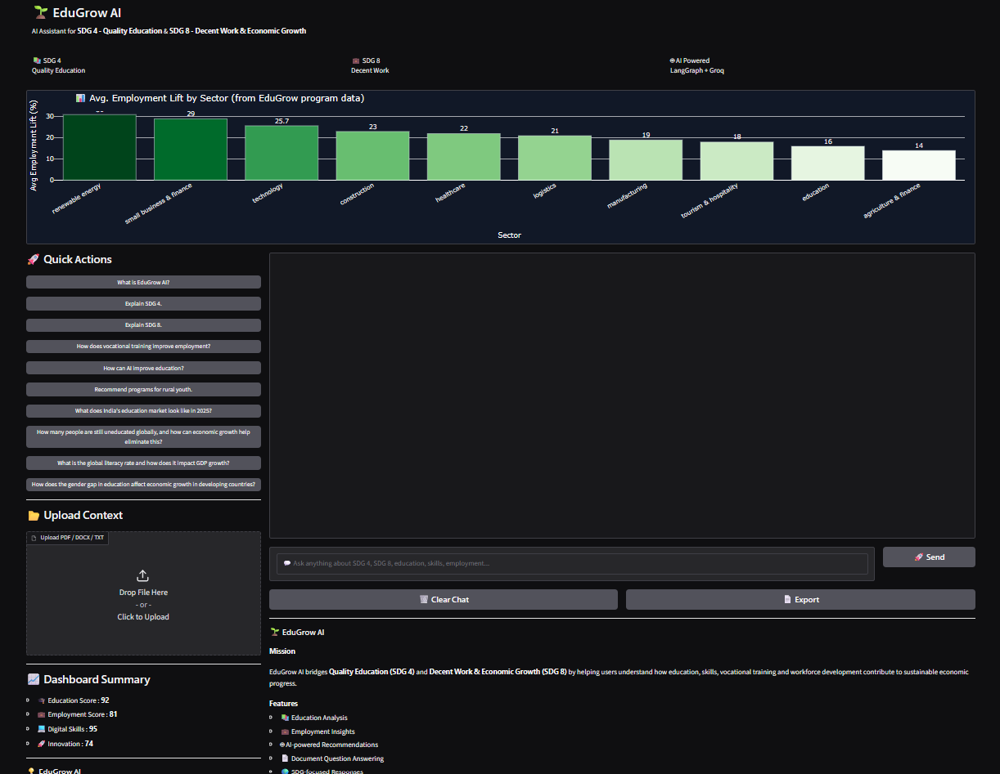
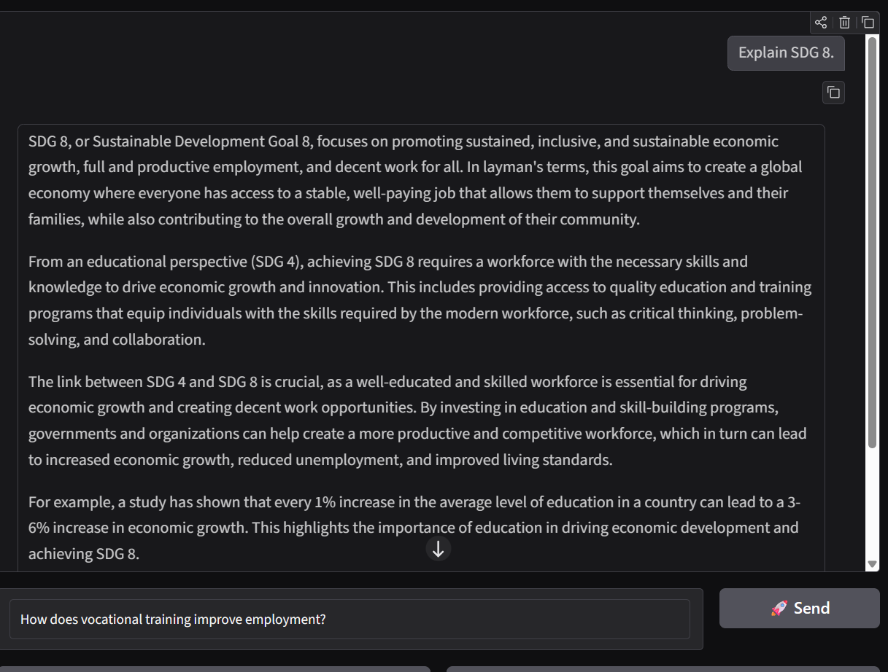
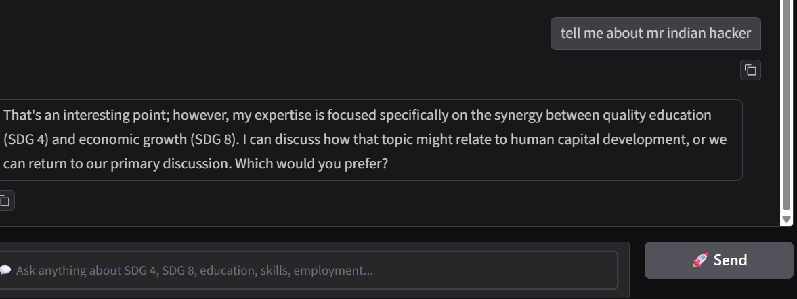

# 🌱 EduGrow AI | IBM 2026 Summer Internship Project

## 📖 Overview

EduGrow AI is an AI-powered advisory assistant that explores the relationship between **Quality Education (SDG 4)** and **Decent Work & Economic Growth (SDG 8)**. Built using **LangGraph**, **LangChain**, **Groq Llama 3.3 70B**, and **Gradio**, the application helps users understand how education, skill development, and workforce initiatives contribute to sustainable economic growth.

The project was developed as part of the **IBM 2026 Summer Internship**.

---

## 🚀 Live Demo

**Render Deployment**

🔗 **https://edugrow-ai.onrender.com/**

> **Note:** This application is hosted on Render's free tier. If the service has been inactive, it may take **30–60 seconds** to wake up before loading.

---

## 🎯 Problem Statement

Many discussions around education and employment focus on these topics separately. EduGrow AI bridges this gap by explaining how educational investments, vocational training, and skill-development programs influence employment opportunities, productivity, and economic growth.

The assistant provides AI-generated insights while remaining focused on the intersection of:

* 📚 SDG 4 – Quality Education
* 💼 SDG 8 – Decent Work & Economic Growth

---

## ✨ Features

* 🤖 AI-powered conversational assistant
* 🌍 SDG-focused responses
* 📄 PDF, DOCX, and TXT document understanding
* 🧠 LangGraph multi-node workflow
* 🔀 Intelligent query classification
* 📊 Interactive dashboard using Plotly
* 💬 Modern Gradio chat interface
* 📥 Export conversation as a text file
* ☁️ Cloud deployment on Render

---
## 📸 Screenshots

### Home Page



---

### AI Chat Example



---

### Off-Topic Response



## 🛠️ Tech Stack

### Programming Language

* Python

### AI & LLM

* LangChain
* LangGraph
* Groq API
* Llama 3.3 70B Versatile

### Frontend

* Gradio

### Data Processing

* Pandas

### Visualization

* Plotly

### Document Processing

* PyMuPDF
* python-docx

### Deployment

* Render

---

## ⚙️ Project Workflow

1. User enters a question.
2. (Optional) User uploads a PDF, DOCX, or TXT document.
3. LangGraph classifies the query into:

   * Meta
   * On Topic
   * Gray Area
   * Off Topic
4. The appropriate agent node processes the request.
5. Groq Llama 3.3 generates an intelligent response.
6. The response is displayed in the Gradio interface.

---

## 📂 Supported File Types

* PDF
* DOCX
* TXT

Uploaded documents are used as additional context for generating more relevant responses.

---

## 📊 Dashboard

The application includes a simple interactive dashboard that visualizes sample employment improvement across different sectors using Plotly.

---

## 📸 Application Preview

Add screenshots here after deployment.

Example:

```text
images/homepage.png
images/chat.png
images/dashboard.png
```

---

## 📦 Installation

Clone the repository:

```bash
git clone https://github.com/Aryan-6-6-6/EduGrow-AI-IBM-2026.git
```

Navigate to the project directory:

```bash
cd EduGrow-AI-IBM-2026
```

Create a virtual environment:

```bash
python -m venv .venv
```

Activate the environment:

### Windows

```bash
.venv\Scripts\activate
```

### Linux / macOS

```bash
source .venv/bin/activate
```

Install dependencies:

```bash
pip install -r requirements.txt
```

Create a `.env` file:

```env
GROQ_API_KEY=YOUR_GROQ_API_KEY
```

Run the application:

```bash
python app.py
```

---

## 📁 Project Structure

```text
EduGrow-AI-IBM-2026/
│
├── app.py
├── requirements.txt
├── .gitignore
├── README.md
└── images/
```

---

## 🔮 Future Improvements

* Support multiple document uploads
* Add document summarization
* Integrate real-world education datasets
* Support multilingual conversations
* User authentication
* Chat history database
* Advanced analytics dashboard
* RAG-based knowledge retrieval
* Voice interaction

---

## 👨‍💻 Developer

**Aryan Gupta**

BCA Student | Aspiring Data Scientist | Machine Learning Enthusiast

GitHub: https://github.com/Aryan-6-6-6

---

## 📜 License

This project is developed for educational and internship purposes.
